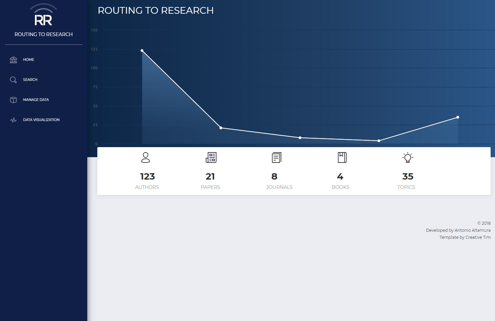
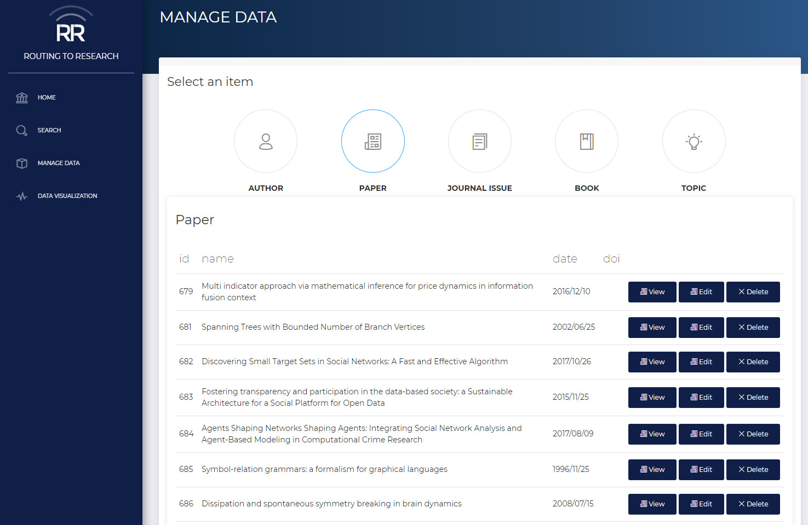
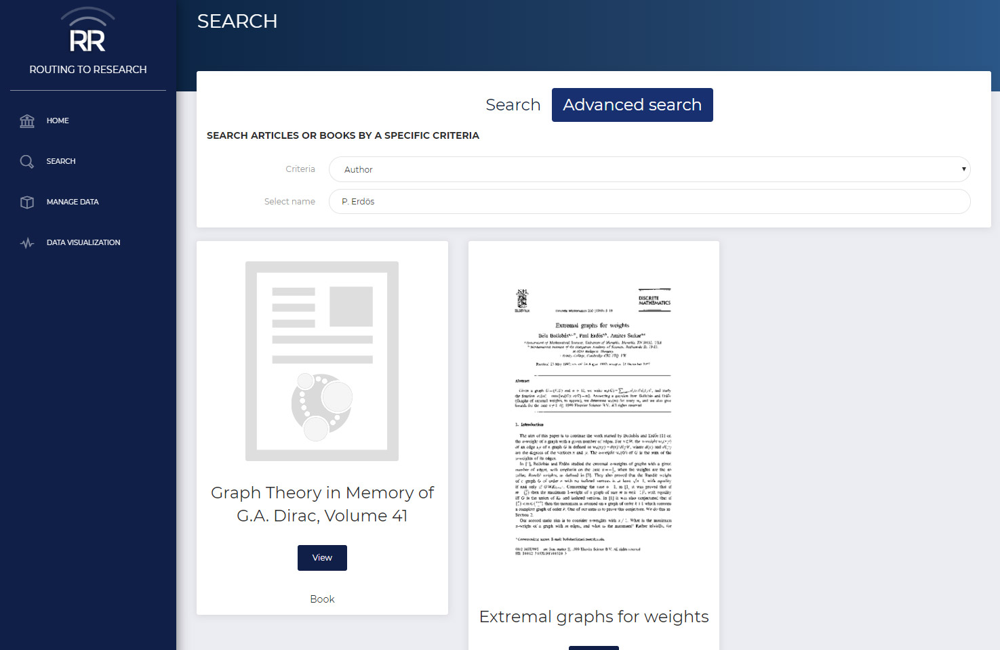
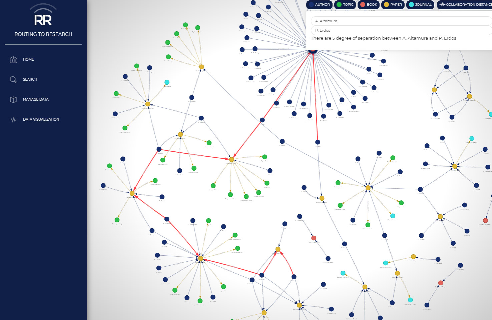

# Routing to Research

## Installation
- Install Node.js https://nodejs.org/en/
- Install Neo4j for your platform https://neo4j.com
- Install `yarn` module `npm install -g yarn`
- Add your local credentials in `config.js`
- run `yarn install`
- run `cd public && yarn install`

## DB initialization
- Copy the files in CSV folder in the Neo4j **import** folder
- from the project root run `yarn init` 

## Run
Just launch
`yarn start` and open `http://localhost:3000`

**NOTE:** When you upload a pdf in "Routing to Research" the file will be saved in `./public/storage`. Sample pdf files has been removed for copyright reason.

**NOTE:** `pdf-image` module has been fixed to works with the current release of ImageMagick for Windows (7.0.8-6).
In order to work with Linux env you need to edit the Imagemagick command on `utils/pdf-image/index.js` on `#96` and `#104`.

